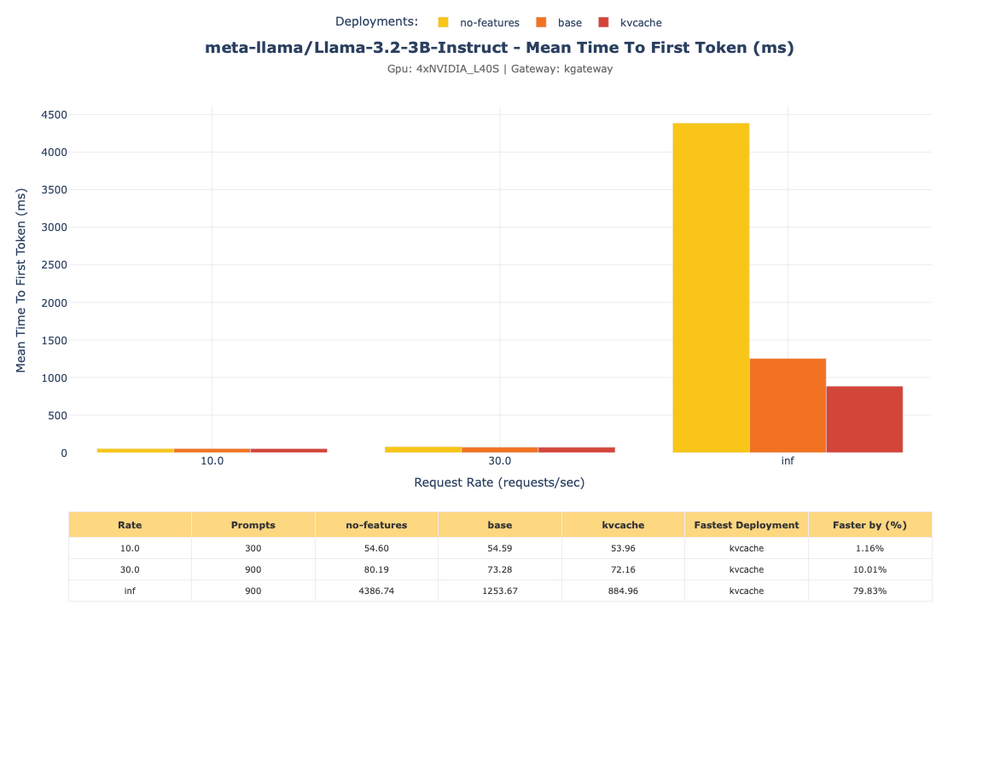

# VLLM Benchmark Graphing

## Run

- With `results.json` in the same directory (or use the included sample) run:

```commandline
python3.12 -m venv venv
source venv/bin/activate

python vllmd-deployment-compare-gem.py --export-html -f results.json 
```

- For static png graphs run:

```commandline
python prompt-comparisons.py --export png
python metric-perfs.py --export png
```

Example output:


